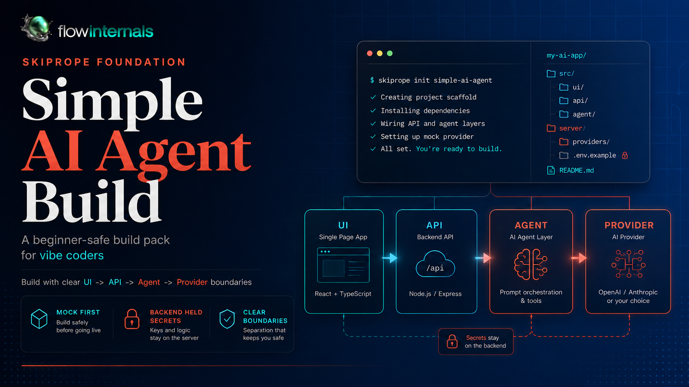
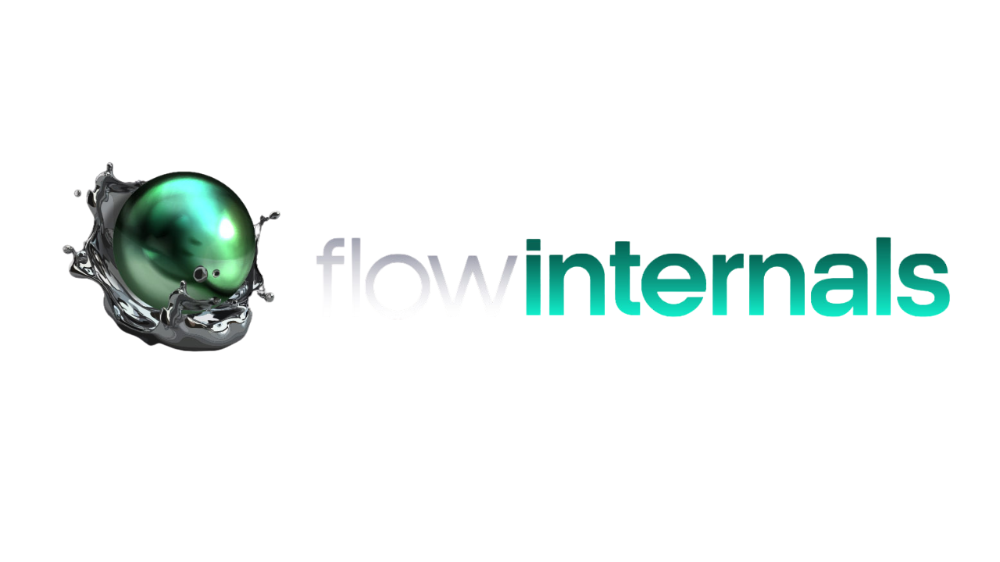

# SkipRope Foundation - Simple AI Agents Companion Repo

<p align="center">
  
</p>

This repository is the companion build reference for the Flowinternals SkipRope Foundation - Simple AI Agents series from [Flowinternals.net](https://flowinternals.net/).

It is here to help you move through the series with more confidence. The walkthrough documents explain what each phase is trying to teach. This repo shows how the application changes as those phases progress.

Copyright Flowinternals. All rights reserved.

This repository is publicly visible for reference only.
No license is granted to use, copy, modify, distribute, sublicense, or commercialize any part of this codebase or its associated assets without prior written permission.

Flowinternals 2026. All rights reserved.

flowinternals is a wholly owned product of Sagesilver Pty Ltd (ABN: 50096086821).

<p align="center">
  
</p>

## How To Use This Repo

The commit history is aligned to the phase journey in the pack. As you move through your own app, you can walk through the commits here in the same order and inspect how the structure, UI, API layer, agent service, provider boundary, testing, and hardening work evolve over time.

The most useful way to use this repo is side by side with your own project in Cursor:

- open your app and this repo in separate workspaces or side-by-side windows
- move to the phase you are currently working on in the SkipRope documents
- inspect the matching commit range in this repo
- ask Cursor to compare your current files, structure, and behaviour against the same stage in this reference app
- use the differences to understand architecture drift, missing pieces, or safer next steps

This repo is meant to support the guided journey, not replace it. The strongest learning path is to let the phase document explain the goal first, then use this repo to compare what changed and why.

## What This Repo Represents

This app follows the same core architecture taught throughout the series:

```text
React UI
  ->
HTTP / JSON
  ->
Express API
  ->
Agent Service
  ->
Provider Adapter
  ->
AI Provider or Mock Provider
```

It is intentionally a clean companion implementation of the walkthrough, not a separate product line and not a one-click finished shortcut.

## Suggested Comparison Workflow

When you are partway through a phase, give Cursor a narrow comparison task rather than a vague request. Good examples include:

- compare my current UI structure against the matching Phase G commit in the companion repo
- compare my API route and validation flow against the matching Phase H changes
- compare my agent-service boundary against the reference repo and point out where my app has drifted
- compare my hardening changes against the later phase commits and tell me what is still missing

That workflow keeps the repo useful as a teaching aid instead of turning it into something you copy blindly.

## Scripts

- `npm run dev` starts the frontend and backend together
- `npm run dev:ui` starts the Vite frontend
- `npm run dev:api` starts the Express backend
- `npm run build` builds the frontend
- `npm test` runs colocated unit tests (Node + Vitest)
- `npm run test:readiness` runs the mock HTTP regression gate (API must be running)

## Folders

- `src/` frontend UI
- `server/routes/` thin API routes
- `server/services/` agent logic
- `server/providers/` provider adapter and provider implementations
- `server/validation/` request validation helpers
- `tests/` reusable e2e, regression, and fixture assets - see [`tests/README.md`](tests/README.md)
- `release-notes/` install logs
